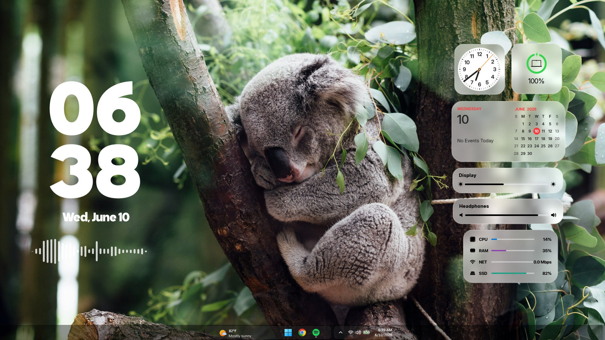

# 🪟 Windows Tahoe - Liquid Glass Rainmeter Suite

Transform your desktop to look like macOS Tahoe with these visually stunning, translucent widgets.

### 📱 Included Widgets (13)

Clock, Calendar, Calendar Clock, Calendar Wide, Date, Date Events, Date Month, Clock Date, Battery, System, Sound, Visualizer, Weather

### ⚙️ Features

* 14 Widgets with full Dark & Light mode support (can change individually if needed).

* Effortlessly turn the background blur or absolute transparency On or Off to match your style.

### 🚀 How to Install

1. Download and install [Rainmeter](https://www.rainmeter.net/).
2. Download and run the `.rmskin` file.
2. Download these Fonts: Inter, SF Pro Display, Samsung Sharp Sans
2. Download and run the .rmskin` file.

### 🎨 Credits

* **Created by:** @ChamikaNLakshan

* **EasyBlur Plugin:** @fediaFedia

* **Font Used:** Inter